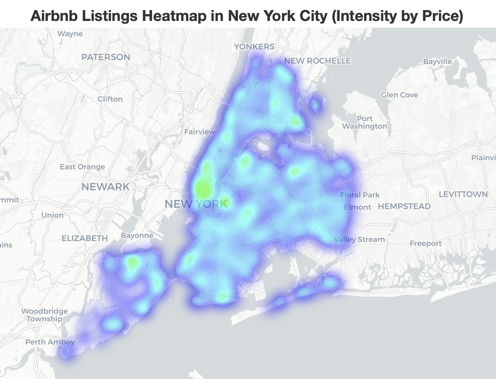

# NYC Airbnb Data Analysis

## Description
Analysis of 48,895 NYC Airbnb listings to uncover pricing trends, popular areas, and insights for hosts and travelers. Includes visualizations, heatmaps, and Python code. Dataset from [Kaggle](https://www.kaggle.com/datasets/dgomonov/new-york-city-airbnb-open-data).

## Objectives
- Identify pricing trends by neighborhood and room type
- Detect and handle outliers
- Explore relationships between reviews, location, and demand
- Visualize geographic price distribution

## Key Questions Answered
- Where are the most expensive/affordable neighborhoods?
- How does room type impact pricing?
- What factors influence listing popularity?
- Which areas have the highest Airbnb concentration?
  
### Average Price by Neighborhood and Room Type
(images/average_price_by_neighbourhood-2.png)

## Tools & Methodology
- Python (Pandas, NumPy, Matplotlib, Seaborn, Folium)
- Jupyter Notebook (.ipynb)
- Statistical Analysis (Pearson correlation)
- Google Colab for collaboration
- PDF reports and presentation slides included

## Files in this Repository
- `NYC_Airbnb_Analysis.ipynb` — Python code and analysis
- `Project_Report.pdf` — Detailed Word report with methodology and findings
- `Presentation.pdf` — PowerPoint slides with visual storytelling

## Recommendations & Next Steps
- Hosts: Optimize pricing based on neighborhood and room type
- Travelers: Identify high-value areas using heatmaps
- Airbnb: Encourage listings in underserved areas, highlight best value neighborhoods
- Next Steps: Temporal analysis, competitive benchmarking, feature engineering

